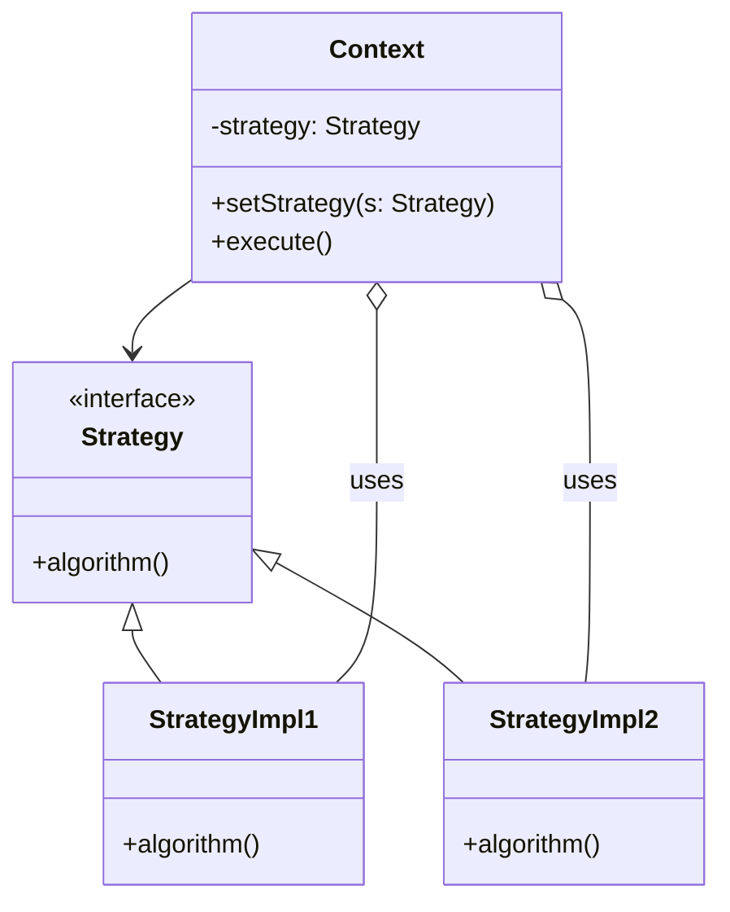

# Strategy Design Pattern — Example Project

A small Java example demonstrating the Strategy design pattern. The code is organized under the package `ma.enset` and shows how to define interchangeable algorithms (strategies) and swap them at runtime without changing the clients that use them.

## Overview
This repository contains a minimal, educational implementation of the Strategy pattern. It is intended for learning and experimentation.

## Project structure
- src/main/java/ma/enset — Java source files (strategies, context, and example/main classes)

## Mermaid diagram
Below is a simple mermaid class diagram explaining the relationships in this project.

