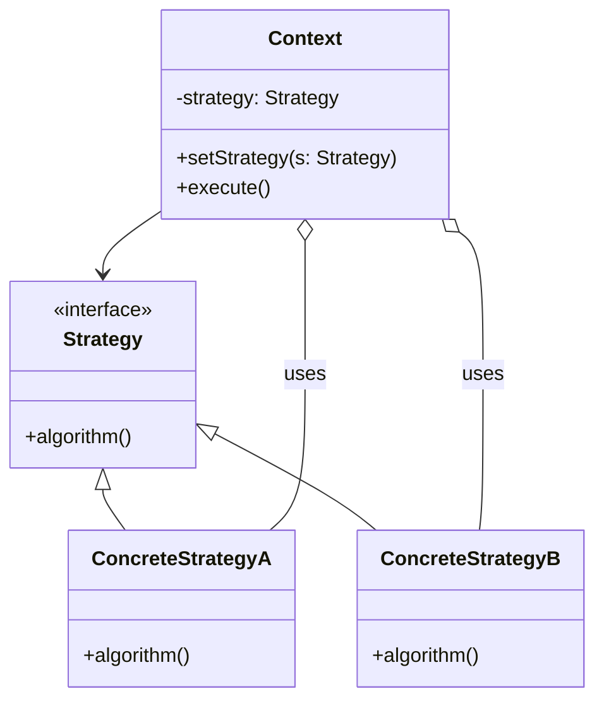

# Strategy Design Pattern — Example Project

A small Java example demonstrating the Strategy design pattern. The code is organized under the package `ma.enset` and shows how to define interchangeable algorithms (strategies) and swap them at runtime without changing the clients that use them.

## Overview
This repository contains a minimal, educational implementation of the Strategy pattern. It is intended for learning and experimentation.

## Project structure
- src/main/java/ma/enset — Java source files (strategies, context, and example/main classes)
- src/test — (optional) tests

## Mermaid diagram
Below is a simple mermaid class diagram explaining the relationships in this project.

## How to run
1. Open the project in your preferred IDE and run the main class under `src/main/java/ma/enset`.
2. Or build and run from the command line:
   - With Maven (if a pom.xml exists): `mvn clean compile` then run the main class via your IDE or `java -cp target/classes <main-class>`
   - Plain javac: `javac -d out $(find src/main/java -name "*.java")` then `java -cp out <main-class>`

Note: Replace `<main-class>` with the actual fully-qualified main class name in the project (e.g., `ma.enset.App`).

## Contributing
Feel free to open issues or pull requests to add examples, tests, or documentation.

## License
Add a license file if you want to make the project open-source.
